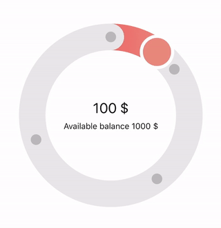

## react-native-circular-picker (WIP)

Apple Card circular picker component in react native.



## Installation

##### 1. Install [react-native-svg](https://github.com/react-native-community/react-native-svg)

``
expo install react-native-svg
``

##### 2. Install react-native-circular-picker

``
yarn add react-native-circular-picker
``

## Usage

```js
import { useState } from 'react';
import CircularPicker from 'react-native-circular-picker';

export default () => {
  const [price, setPrice] = useState(0);
  const handleChange = (v) => setPrice((v * 20).toFixed(0));

  return (
    <CicularPicker
      size={400}
      steps={[15, 40, 70, 100]}
      gradients={{
        0: ['rgb(255, 97, 99)', 'rgb(247, 129, 119)'],
        15: ['rgb(255, 204, 0)', 'rgb(255, 214, 10)'],
        40: ['rgb(52, 199, 89)', 'rgb(48, 209, 88)'],
        70: ['rgb(0, 122, 255)', 'rgb(10, 132, 255)'],
      }}
      onChange={handleChange}
    >
      <>
        <Text style={{ textAlign: 'center', fontSize: 24, marginBottom: 8 }}>{price} $</Text>
        <Text style={{ textAlign: 'center' }}>Available balance 2000 $</Text>
      </>
    </CircularPicker>
  );
}
```

## Props

| Name                  | Default                                                | type       | description       |
| ----------------------|--------------------------------------------------------|------------|-------------------|
| size **(required)**   | -                                                      | number     | size of the component
| strokeWidth           | 45                                                     | number     |
| defaultPos            | 0                                                      | number     |
| setps                 | []                                                     | [number]   |
| gradients             | ``{ 0: ['rgb(255, 204, 0)', 'rgb(255, 214, 10)'] }``   | object     | 
| backgroundColor       | ``'rgb(231, 231, 231)'``                               | string     |
| stepColor             | ``'rgba(0, 0, 0, 0.2)'``                               | string     |
| borderColor           | ``'rgb(255, 255, 255)'``                               | string     |
| onChange              | (val) => undefined                                     | function   | value in percent

#### Setps

You can defines clickable steps on the circle.
steps are defined by an array of position (0 - 100).

#### Gradients

You can define gradients according the position of the cursor on the circle.
Gradients are defined by an object, the key is the starting percentage and the value is an array of colors.

```js
{
  0:  ['rgb(255, 97, 99)', 'rgb(247, 129, 119)'],
  15: ['rgb(255, 204, 0)', 'rgb(255, 214, 10)'],
  40: ['rgb(52, 199, 89)', 'rgb(48, 209, 88)'],
  70: ['rgb(0, 122, 255)', 'rgb(10, 132, 255)'],
}
```

## @TODO
- Animation with React Animated when you click on steps
- Improve end bounding area

## Author

[Florian Guyonnet](https://github.com/florianguyonnet)

## License

MIT
